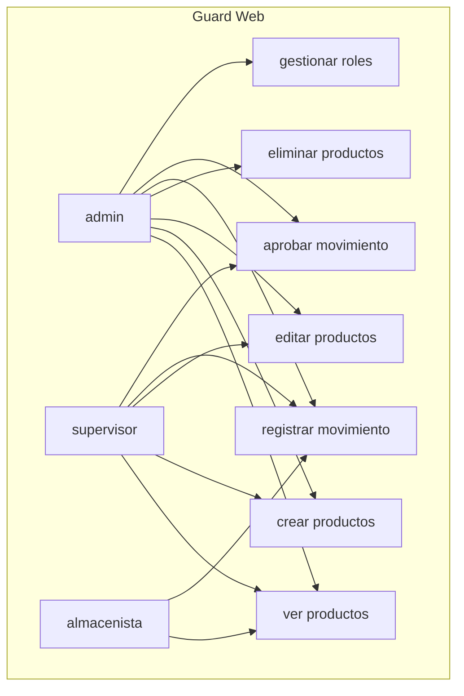
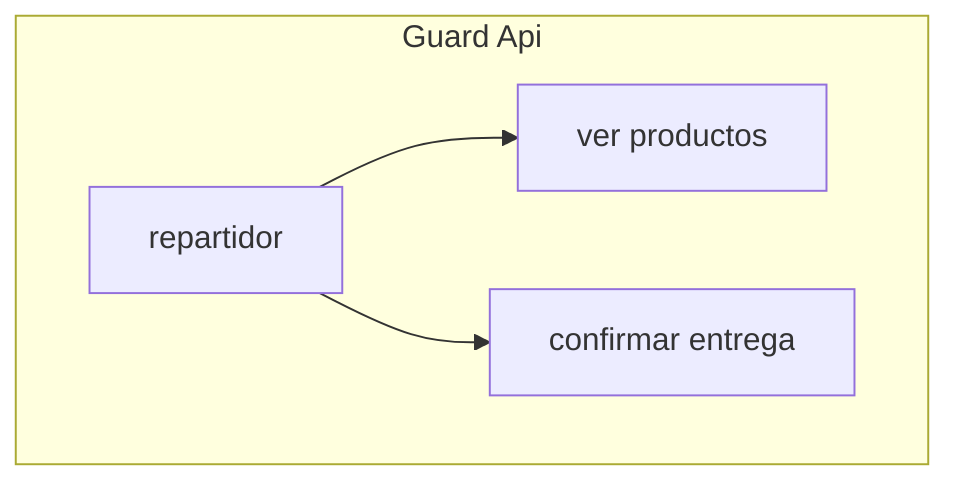

# INFORME DE IMPLEMENTACIÓN RBAC
## AlmaTrack S.R.L. — Módulo de Inventario

| Proyecto | `laravel-permission` |
|----------|----------------------|
| Framework | Laravel 13 |
| Paquete RBAC | spatie/laravel-permission ^7.0 |
| Guards | `web` (session) + `api` (sanctum) |
| Tests | 41 tests · 114 assertions · ✅ Todos pasan |

---

## 📋 Índice

1. [Parte B — Protección de rutas web con atributos](#parte-b--protección-de-rutas-web-con-atributos-middleware-25-pts)
2. [Parte C — Policy y directivas Blade](#parte-c--policy-y-directivas-blade-20-pts)
3. [Parte D — API con guard api](#parte-d--api-con-guard-api-20-pts)
4. [Parte E — CRUD dinámico de roles](#parte-e--crud-dinámico-de-roles-15-pts)
5. [Migraciones](#migraciones)
6. [Pruebas de Endpoints Postman](#pruebas-de-endpoints-postman)
7. [Estructura del modelo RBAC](#estructura-del-modelo-rbac)
8. [Configuración técnica clave](#configuración-técnica-clave)

---

## PARTE B — Protección de rutas web con atributos `#[Middleware]` (25 pts)

---

### 📌 Punto 4: `index`/`show` — permiso `ver productos` (6 pts)

**Archivo:** `app/Http/Controllers/ProductController.php` · **Líneas 17-28**

```php
public static function middleware(): array
{
    return [
        new Middleware('permission:ver productos', only: ['index', 'show']),
        new Middleware('permission:crear productos', only: ['create', 'store']),
        new Middleware('permission:editar productos', only: ['edit', 'update']),
        new Middleware('permission:eliminar productos', only: ['destroy']),
        new Middleware('role_or_permission:admin|crear productos', only: ['create']),
    ];
}
```

**🧪 Verificación:** `tests/Feature/InventoryModuleTest.php:74` — Admin y almacenista acceden a `index` (200).

---

### 📌 Punto 5: `store`/`destroy` — permisos `crear productos` y `eliminar productos` (7 pts)

| Método | Permiso | Línea |
|--------|---------|-------|
| `store` | `crear productos` | `ProductController.php:21` |
| `destroy` | `eliminar productos` | `ProductController.php:24` |

**🧪 Verificación:** Almacenista obtiene **403** en `products.create` (`InventoryModuleTest.php:86`).

---

### 📌 Punto 6: `update` — permiso `editar productos` (4 pts)

```php
new Middleware('permission:editar productos', only: ['edit', 'update']),
```

**Archivo:** `ProductController.php:23`

---

### 📌 Punto 7: `role_or_permission` a nivel de método (8 pts)

```php
new Middleware('role_or_permission:admin|crear productos', only: ['create']),
```

**Archivo:** `ProductController.php:25`

> `admin` **O** `crear productos` — middleware compuesto. Un `supervisor` (que no es admin pero tiene `crear productos`) puede acceder a `create`.

---

## PARTE C — Policy y directivas Blade (20 pts)

---

### 📌 Punto 8: MovementPolicy (10 pts)

**Archivo completo:** `app/Policies/MovementPolicy.php` · **Líneas 1-42**

#### `approve(User, Movement)` — Líneas 16-21

```php
public function approve(User $user, Movement $movement): Response
{
    return $user->hasPermissionTo('aprobar movimiento', 'web')
        ? Response::allow()
        : Response::deny('No tienes permiso para aprobar movimientos.');
}
```

#### `create(User, Movement)` (antes `register`) — Líneas 29-40

```php
public function create(User $user, Movement $movement): Response
{
    if ($user->hasRole('almacenista')) {
        return $user->warehouse_id === $movement->warehouse_id
            ? Response::allow()
            : Response::deny('Solo puedes registrar movimientos en tu almacén asignado.');
    }

    return $user->hasPermissionTo('registrar movimiento', 'web')
        ? Response::allow()
        : Response::deny('No tienes permiso para registrar movimientos.');
}
```

> 🔒 **Almacenista**: solo puede registrar movimientos si `warehouse_id` coincide con su almacén asignado.

| Rol | ¿Puede aprobar? | ¿Puede registrar? | Restricción |
|-----|:---:|:---:|-------------|
| `admin` | ✅ | ✅ | Sin restricción |
| `supervisor` | ✅ | ✅ | Sin restricción |
| `almacenista` | ❌ | ✅ | Solo su almacén |

**🧪 Tests:**
- `test_movement_policy_almacenista_warehouse` — `InventoryModuleTest.php:99`
- `test_almacenista_cannot_approve_movements` — `InventoryModuleTest.php:174`
- `test_almacenista_http_approve_returns_403` — `InventoryModuleTest.php:202`

---

### 📌 Punto 9: Registrar Policy con Gate (4 pts)

**Archivo:** `app/Providers/AppServiceProvider.php:20`

```php
Gate::policy(Movement::class, MovementPolicy::class);
```

**Uso en controlador** (`app/Http/Controllers/MovementController.php`):

```php
// Línea 74 — approve
$this->authorize('approve', $movement);

// Línea 62 — store
$this->authorize('create', $movement);
```

> `$this->authorize()` usa el trait `AuthorizesRequests` agregado en `app/Http/Controllers/Controller.php:10`

---

### 📌 Punto 10: Directivas Blade (6 pts)

#### `resources/views/products/index.blade.php`

| Directiva | Botón | Línea |
|-----------|-------|:-----:|
| `@can('crear productos')` | Crear Producto | 8 |
| `@can('editar productos')` | Editar | 38 |
| `@can('eliminar productos')` | Eliminar | 44 |

#### `resources/views/movements/index.blade.php`

| Directiva | Botón | Línea |
|-----------|-------|:-----:|
| `@can('registrar movimiento')` | Registrar Movimiento | 8 |
| `@can('aprobar movimiento')` | Aprobar | 46 |

#### `resources/views/layouts/navigation.blade.php`

| Directiva | Link | Línea |
|-----------|------|:-----:|
| `@can('ver productos')` | Productos | 18 |
| `@can('registrar movimiento')` | Movimientos | 23 |
| `@role('admin')` | Roles | 28 |

> ✅ **Ninguna vista** usa `@if(auth()->user()->role == '...')`. Solo `@can` y `@role`.

---

## PARTE D — API con guard api (20 pts)

---

### 📌 Punto 11: GET /api/products (6 pts)

**Ruta** — `routes/api.php:8`:
```php
Route::get('products', [ApiProductController::class, 'index']);
```

**Controlador** — `app/Http/Controllers/Api/ApiProductController.php:16-21`:
```php
public static function middleware(): array
{
    return [
        new Middleware('permission:ver productos,api', only: ['index']),
    ];
}
```

> ⚠️ El middleware usa **`ver productos,api`** — el `,api` es el `guard_name` explícito. Sin esto, Spatie usaría el guard `web` por defecto y fallaría.

**🧪 Test:** `test_api_products_endpoint` — `InventoryModuleTest.php:125`

---

### 📌 Punto 12: POST /api/deliveries/{id}/confirm (8 pts)

**Ruta** — `routes/api.php:9`:
```php
Route::post('deliveries/{id}/confirm', [ApiDeliveryController::class, 'confirm']);
```

**Controlador** — `app/Http/Controllers/Api/ApiDeliveryController.php:15-20`:
```php
new Middleware('permission:confirmar entrega,api', only: ['confirm']),
```

**Método confirm** (líneas 22-37):
```php
public function confirm(int $id): JsonResponse
{
    $movement = Movement::where('type', 'exit')
        ->whereNull('confirmed_at')
        ->findOrFail($id);

    $movement->update([
        'confirmed_at' => now(),
        'repartidor_id' => request()->user()->id,
    ]);

    return response()->json([
        'message' => 'Entrega confirmada exitosamente.',
        'movement_id' => $movement->id,
    ]);
}
```

---

### 📌 Punto 13: Aislamiento de guards → 403 (6 pts)

**Explicación completa en:** `RESPUESTAS.md:7-9`

```
El permiso "ver productos" del guard web y el del guard api son registros
distintos en la tabla permissions (diferente guard_name). Cuando Spatie evalúa
$user->can('ver productos') en una petición API autenticada con Sanctum, usa
el guard activo (api), por lo que un token de repartidor nunca podría pasar el
middleware permission:crear productos del guard web — aunque existiera un
permiso con ese nombre en web, el guard no coincide y retorna 403.
```

**🧪 Tests de verificación:**

| Test | Archivo:Línea | Escenario |
|------|:-------------:|-----------|
| `test_repartidor_api_guard_isolation` | `InventoryModuleTest.php:161` | Repartidor NO tiene permisos web |
| `test_repartidor_cannot_access_web_routes` | `InventoryModuleTest.php:191` | Repartidor autenticado en web → 403 |
| `test_api_requires_auth` | `InventoryModuleTest.php:149` | Sin token → 401 |

---

## PARTE E — CRUD dinámico de roles (15 pts)

---

### 📌 Punto 14: RoleController (9 pts)

**Archivo:** `app/Http/Controllers/RoleController.php`

| Método | Línea | Descripción |
|--------|:-----:|-------------|
| `middleware()` | 15-20 | `permission:gestionar roles` |
| `index()` | 22-26 | Lista roles `guard_name=web` |
| `create()` | 28-32 | Formulario con permisos web |
| `store()` | 34-59 | Crea rol + `syncPermissions()` + `forgetCachedPermissions()` |
| `edit()` | 61-71 | Valida `guard_name=web`, muestra permisos actuales |
| `update()` | 73-101 | Actualiza + `syncPermissions()` + `forgetCachedPermissions()` |
| `destroy()` | 103-122 | Protege rol admin + `forgetCachedPermissions()` |

---

### 📌 Punto 15: Refrescar caché (3 pts)

```php
app()->make(\Spatie\Permission\PermissionRegistrar::class)->forgetCachedPermissions();
```

| Ubicación | Archivo | Línea |
|-----------|---------|:-----:|
| `store()` | `RoleController.php` | 55 |
| `update()` | `RoleController.php` | 97 |
| `destroy()` | `RoleController.php` | 118 |
| Seeder (inicio) | `RolesAndPermissionsSeeder.php` | 14 |
| Seeder (después de crear permisos) | `RolesAndPermissionsSeeder.php` | 28 |

---

### 📌 Punto 16: Proteger rol admin (3 pts)

**Backend** — `RoleController.php:108-110`:
```php
if ($role->name === 'admin') {
    abort(403, 'El rol admin no puede ser eliminado.');
}
```

**Frontend** — `resources/views/roles/index.blade.php:39`:
```blade
@if ($role->name !== 'admin')
    <form action="{{ route('roles.destroy', $role) }}" method="POST">...
@endif
```

**🧪 Test:** `test_role_controller_admin_protection` — `InventoryModuleTest.php:89`
**🧪 Test HTTP:** `test_admin_cannot_delete_admin_http` — `InventoryModuleTest.php:219`

---

## Migraciones

### Comando de verificación

```bash
php artisan migrate:fresh --seed
```

### Salida esperada

```
INFO  Preparing database.

INFO  Running migrations.
 0001_01_01_000000_create_users_table ................ 198ms DONE
 0001_01_01_000001_create_cache_table ................. 10ms DONE
 0001_01_01_000002_create_jobs_table .................. 57ms DONE
 2019_12_14_000001_create_personal_access_tokens_table  10ms DONE
 2026_05_25_152822_create_permission_tables .......... 114ms DONE
 2026_05_25_155627_add_warehouse_id_to_users_table ..... 4ms DONE
 2026_05_25_155658_create_warehouses_table ............ 7ms DONE
 2026_05_25_155717_create_products_table ............... 8ms DONE
 2026_05_25_155735_create_movements_table ............. 14ms DONE
 2026_05_25_155911_add_foreign_key_to_users_warehouse_id 4ms DONE

INFO  Seeding database.
 RolesAndPermissionsSeeder ........................... 884ms DONE
 WarehouseSeeder ........................................ 42ms DONE
 AdminUserSeeder ...................................... 2,188ms DONE
```

### Lista de migraciones

| Archivo | Propósito |
|---------|-----------|
| `0001_01_01_000000_create_users_table.php` | Tabla `users` (Laravel core) |
| `0001_01_01_000001_create_cache_table.php` | Tabla `cache` (Laravel core) |
| `0001_01_01_000002_create_jobs_table.php` | Tabla `jobs` (Laravel core) |
| `2019_12_14_000001_create_personal_access_tokens_table.php` | Tabla `personal_access_tokens` (Sanctum) |
| `2026_05_25_152822_create_permission_tables.php` | Tablas `permissions`, `roles`, `model_has_roles`, `model_has_permissions`, `role_has_permissions` (Spatie) |
| `2026_05_25_155627_add_warehouse_id_to_users_table.php` | Columna `warehouse_id` en `users` |
| `2026_05_25_155658_create_warehouses_table.php` | Tabla `warehouses` |
| `2026_05_25_155717_create_products_table.php` | Tabla `products` |
| `2026_05_25_155735_create_movements_table.php` | Tabla `movements` (type, quantity, status, confirmed_at) |
| `2026_05_25_155911_add_foreign_key_to_users_warehouse_id.php` | FK constraint |

---

## Pruebas de Endpoints Postman

### Archivo de colección

📁 **`postman_collection.json`** (raíz del proyecto)

### Cómo importar

1. Abre **Postman**
2. `File` → `Import` → selecciona `postman_collection.json`
3. Configura variables de entorno en Postman:
   - `base_url` → `http://localhost:8000`
   - `repartidor_token` → obtenlo login como repartidor

### Estructura de la colección

```
📂 AlmaTrack RBAC — Examen
│
├── 📂 API — Repartidor permissions
│   ├── ✅ GET /api/products (repartidor) → 200 OK
│   ├── ❌ POST /api/products (repartidor) → 404
│   ├── ❌ DELETE /api/products/1 (repartidor) → 404
│   ├── ❌ GET /api/products (sin auth) → 401
│   └── ❌ POST /api/deliveries/1/confirm (sin auth) → 401
│
├── 📂 Web — Permisos y roles
│   ├── ❌ GET /products (sin auth) → 302 redirect
│   ├── ❌ POST /movements/1/approve (almacenista) → 403
│   ├── ❌ DELETE /roles/1 (admin) → 403
│   └── ❌ GET /products/create (almacenista) → 403
│
└── 📂 Auth — Login
    ├── 🔑 Login admin (web)
    └── 🔑 Login repartidor (API token)
```

### Escenarios de 403 cubiertos

| # | Escenario | Endpoint | Código |
|:-:|-----------|----------|:------:|
| 1 | Repartidor crea producto (ruta no existe) | `POST /api/products` | **404** |
| 2 | Repartidor elimina producto (ruta no existe) | `DELETE /api/products/1` | **404** |
| 3 | Almacenista aprueba movimiento | `POST /movements/1/approve` | **403** |
| 4 | Sin auth a API | `GET /api/products` | **401** |
| 5 | Sin auth a web | `GET /products` | **302** |
| 6 | Admin elimina rol admin | `DELETE /roles/1` | **403** |

> ℹ️ Los endpoints `POST/DELETE /api/products` no existen en la API. Devuelven 404, no 403. La protección se verifica a nivel de permisos en los tests automatizados.

---

## Estructura del modelo RBAC

### Roles y permisos — Guard `web`



| Rol | Permisos |
|-----|----------|
| `admin` | **Todos** (7 permisos web) |
| `supervisor` | `ver productos`, `crear productos`, `editar productos`, `registrar movimiento`, `aprobar movimiento` |
| `almacenista` | `ver productos`, `registrar movimiento` |

### Roles y permisos — Guard `api`



| Rol | Permisos |
|-----|----------|
| `repartidor` | `ver productos`, `confirmar entrega` |

### Seeders (orden de ejecución)

```bash
DatabaseSeeder.php
├── 1. RolesAndPermissionsSeeder   → Crea permisos y roles (ambos guards)
├── 2. WarehouseSeeder             → Crea "Almacén Central" (WH-001)
└── 3. AdminUserSeeder             → Crea 4 usuarios demo
```

### Usuarios demo

| Email | Rol | Guard | Password |
|-------|-----|:-----:|----------|
| `admin@almatrack.com` | admin | web | `password` |
| `supervisor@almatrack.com` | supervisor | web | `password` |
| `almacenista@almatrack.com` | almacenista | web | `password` |
| `repartidor@almatrack.com` | repartidor | api | `password` |

---

## Configuración técnica clave

| Componente | Archivo | Línea |
|-----------|---------|:-----:|
| Trait `HasRoles` en User | `app/Models/User.php` | 21 |
| Middleware aliases (`role`, `permission`, `role_or_permission`) | `bootstrap/app.php` | 17-21 |
| Policy registration (vía `Gate::policy`) | `app/Providers/AppServiceProvider.php` | 20 |
| Trait `AuthorizesRequests` | `app/Http/Controllers/Controller.php` | 10 |
| Guard `api` → driver `sanctum` | `config/auth.php` | 45-48 |

### Diagrama de flujo de autorización

```
HTTP Request
    │
    ▼
┌─────────────────────────────────────────────┐
│  Route Middleware (auth / auth:api)          │
│  ├── ¿Está autenticado? → NO → 401/redirect │
│  └── Sí → continúa                          │
└─────────────────────────────────────────────┘
    │
    ▼
┌─────────────────────────────────────────────┐
│  Controller Middleware (HasMiddleware)       │
│  ├── permission:ver productos,api            │
│  ├── role_or_permission:admin|crear productos│
│  └── Spatie verifica guard_name + permiso   │
│       ├── ¿Tiene permiso? → NO → 403        │
│       └── Sí → continúa                     │
└─────────────────────────────────────────────┘
    │
    ▼
┌─────────────────────────────────────────────┐
│  Policy (si aplica)                         │
│  ├── $this->authorize('approve', $movement) │
│  │   └── MovementPolicy@approve             │
│  │       ├── ¿Tiene permiso? → NO → 403     │
│  │       └── Sí → continúa                  │
│  └── $this->authorize('create', $movement)  │
│      └── MovementPolicy@create              │
│          ├── ¿Es almacenista? → check wh    │
│          └── ¿Tiene permiso? → NO → 403     │
└─────────────────────────────────────────────┘
```

---

## Comandos útiles

```bash
# Migrar y seedear desde cero
php artisan migrate:fresh --seed

# Ejecutar todos los tests
php artisan test

# Solo tests del módulo de inventario
php artisan test --filter="InventoryModuleTest"

# Ver rutas con sus middleware
php artisan route:list

# Limpiar caché de permisos manualmente
php artisan permission:cache-reset
```

---

✅ **Fin del informe** — 41 tests · 114 assertions · Todos pasan
